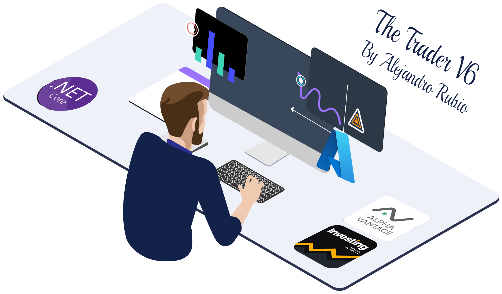

<!-- Improved compatibility of Subir al inicio link: See: https://github.com/othneildrew/Best-README-Template/pull/73 -->

[![Contributors][contributors-shield]][contributors-url]
[![Forks][forks-shield]][forks-url]
[![Stargazers][stars-shield]][stars-url]
[![Issues][issues-shield]][issues-url]
[![MIT License][license-shield]][license-url]
[![LinkedIn][linkedin-shield]][linkedin-url]

<!-- PROJECT LOGO -->
 

  

  <h3 align="center">The Trader App - V6</h3>

  

    C# Console app for Tactical Asset Management
     
    <a href=""><strong>Explore the docs »</strong></a>
     
     
    <a href="">View Demo</a>
    ·
    <a href="">Report Bug</a>
    ·
    <a href="">Request Feature</a>
  

<!-- TABLE OF CONTENTS -->

  
Contenido

  <ol>
    <li>
      <a href="#about-the-project">About The Project</a>
      <ul>
        <li><a href="#built-with">Built With</a></li>
      </ul>
    </li>
    <li>
      <a href="#getting-started">Getting Started</a>
      <ul>
        <li><a href="#prerequisites">Prerequisites</a></li>
        <li><a href="#installation">Installation</a></li>
      </ul>
    </li>
    <li><a href="#usage">Usage</a></li>
    <li><a href="#roadmap">Roadmap</a></li>
    <li><a href="#contributing">Contributing</a></li>
    <li><a href="#license">License</a></li>
    <li><a href="#contact">Contact</a></li>
    <li><a href="#acknowledgments">Acknowledgments</a></li>
  </ol>

<!-- ABOUT THE PROJECT -->
## Sobre el proyecto

El proyecto desarrollado consiste en una aplicación de consola en .Net Core 6 para gestión de activos de renta variables (principalmente acciones, fondos y ETFs).

Entre las funcionalidad actualmente implementadas están:

* Gestión de ventas y compras de activos (implemntado sobre una BD SQL Server que se debe configurar en la aplicación)
* Cálculo del valor actual de la cartera
    * Método 1: Web scrapping sobre [Investing.com](https://www.investing.com/)
    * Método 2: uso del API público de [Alphavantage.co](https://www.alphavantage.co/)
* RoboAdvisor personalizado con alertas basadas en indicadores técnicos (principalmente MACD y momentum)
    * Sobre listado de acciones personalizado
    * Sobre los principales índices

Aparte de esta funcionalidades principales se han desarrollados otros métodos de testing y administración de la aplicación.
    

(<a href="#readme-top">Subir al inicio</a>)

### Stack

* [![Next][Next.js]][Next-url]
* [![React][React.js]][React-url]
* [![Vue][Vue.js]][Vue-url]
* [![Angular][Angular.io]][Angular-url]
* [![Svelte][Svelte.dev]][Svelte-url]
* [![Laravel][Laravel.com]][Laravel-url]
* [![Bootstrap][Bootstrap.com]][Bootstrap-url]
* [![JQuery][JQuery.com]][JQuery-url]
* HTML Agility Pack Libraries

(<a href="#readme-top">Subir al inicio</a>)

<!-- GETTING STARTED -->
## Instalación local

Los siguientes componentes son necesarios para la ejecución o desarrollo en local del proyecto:

* Visual Studio para la compilación y ejecución del proyecto (fichero .exe generable)
* BD SQL Server local o remota

### Pre-requisitos

* ASP.NET Core Runtime 6.0.X
    * https://dotnet.microsoft.com/en-us/download/dotnet/6.0

### Instalación

(<a href="#readme-top">Subir al inicio</a>)

<!-- USAGE EXAMPLES -->
## Ejemplo de uso

 

(<a href="#readme-top">Subir al inicio</a>)

<!-- ROADMAP -->
## Roadmap 2022

- [x] Integración repositorio GitHub
- [ ] Desarrollo de BD de gestión de cartera de fondos
- [ ] Desarrollo de BD de gestión de cartera de ETFs

Listado de problemas a corregir [open issues](https://github.com/AlejandroRubio/TheTraderV6/issues).

(<a href="#readme-top">Subir al inicio</a>)

<!-- CONTRIBUTING -->
## Contribución al proyecto

Contributions are what make the open source community such an amazing place to learn, inspire, and create. Any contributions you make are **greatly appreciated**.

If you have a suggestion that would make this better, please fork the repo and create a pull request. You can also simply open an issue with the tag "enhancement".
Don't forget to give the project a star! Thanks again!

1. Fork the Project
2. Create your Feature Branch (`git checkout -b feature/AmazingFeature`)
3. Commit your Changes (`git commit -m 'Add some AmazingFeature'`)
4. Push to the Branch (`git push origin feature/AmazingFeature`)
5. Open a Pull Request

(<a href="#readme-top">Subir al inicio</a>)

<!-- LICENSE -->
## License

Distributed under the MIT License. See `LICENSE.txt` for more information.

(<a href="#readme-top">Subir al inicio</a>)

<!-- CONTACT -->
## Contacto

Alejandro Rubio - [@AlexWanderlustX](https://twitter.com/alexwanderlustx) 
alejandro.rubio.ingeniero@gmail.com

Prefil en GitHub: [https://github.com/AlejandroRubio](https://github.com/AlejandroRubio)

(<a href="#readme-top">Subir al inicio</a>)

<!-- MARKDOWN LINKS & IMAGES -->
<!-- https://www.markdownguide.org/basic-syntax/#reference-style-links -->
[contributors-shield]: https://img.shields.io/github/contributors/othneildrew/Best-README-Template.svg?style=for-the-badge
[contributors-url]: https://github.com/othneildrew/Best-README-Template/graphs/contributors
[forks-shield]: https://img.shields.io/github/forks/othneildrew/Best-README-Template.svg?style=for-the-badge
[forks-url]: https://github.com/othneildrew/Best-README-Template/network/members
[stars-shield]: https://img.shields.io/github/stars/othneildrew/Best-README-Template.svg?style=for-the-badge
[stars-url]: https://github.com/othneildrew/Best-README-Template/stargazers
[issues-shield]: https://img.shields.io/github/issues/othneildrew/Best-README-Template.svg?style=for-the-badge
[issues-url]: https://github.com/othneildrew/Best-README-Template/issues
[license-shield]: https://img.shields.io/github/license/othneildrew/Best-README-Template.svg?style=for-the-badge
[license-url]: https://github.com/othneildrew/Best-README-Template/blob/master/LICENSE.txt
[linkedin-shield]: https://img.shields.io/badge/-LinkedIn-black.svg?style=for-the-badge&logo=linkedin&colorB=555
[linkedin-url]: http://es.linkedin.com/in/alejandrorubioingeniero
[product-screenshot]: images/screenshot.png
[Next.js]: https://img.shields.io/badge/next.js-000000?style=for-the-badge&logo=nextdotjs&logoColor=white
[Next-url]: https://nextjs.org/
[React.js]: https://img.shields.io/badge/React-20232A?style=for-the-badge&logo=react&logoColor=61DAFB
[React-url]: https://reactjs.org/
[Vue.js]: https://img.shields.io/badge/Vue.js-35495E?style=for-the-badge&logo=vuedotjs&logoColor=4FC08D
[Vue-url]: https://vuejs.org/
[Angular.io]: https://img.shields.io/badge/Angular-DD0031?style=for-the-badge&logo=angular&logoColor=white
[Angular-url]: https://angular.io/
[Svelte.dev]: https://img.shields.io/badge/Svelte-4A4A55?style=for-the-badge&logo=svelte&logoColor=FF3E00
[Svelte-url]: https://svelte.dev/
[Laravel.com]: https://img.shields.io/badge/Laravel-FF2D20?style=for-the-badge&logo=laravel&logoColor=white
[Laravel-url]: https://laravel.com
[Bootstrap.com]: https://img.shields.io/badge/Bootstrap-563D7C?style=for-the-badge&logo=bootstrap&logoColor=white
[Bootstrap-url]: https://getbootstrap.com
[JQuery.com]: https://img.shields.io/badge/jQuery-0769AD?style=for-the-badge&logo=jquery&logoColor=white
[JQuery-url]: https://jquery.com 